## [fit] You
### [fit] Are **not** an Impostor

---

### Hi, I'm Nick

#### ( @nmeans for those playing along on mobile devices)

---

I build stuff at

to help fix healthcare

^
I'm a senior engineer at WellMatch.
Pair 100% of the time.
Hard problems to make healthcare better.

---

## A Decade

^
* 10 years writing software
* most of the time afraid I was about to be >> FIRED

---

# [fit] FIRED

---

How many times have I been fired in 10+ years of software development?

---

# [fit] Zero

---

(but it might happen any day now)

^ 
* or so my scumbag brain tells me
* peers more competent than me
* bosses weren't seeing the real me

---

# [fit] Impostor
# [fit] Syndrome

---

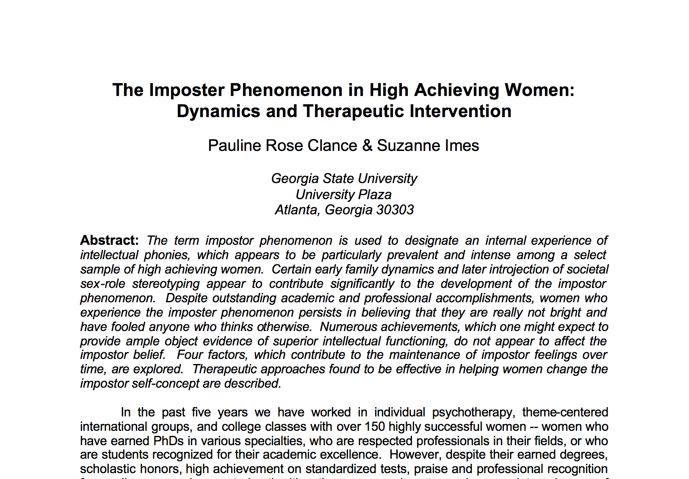

^
* A set of beliefs and behaviors
* Drs. Pauline Rose Clance and Suzanne Imes
* "The Impostor Phenomenon in High Achieving Women"
* Georgia State University, interviews with female grad students
* First thought to only affect women because first identified

---

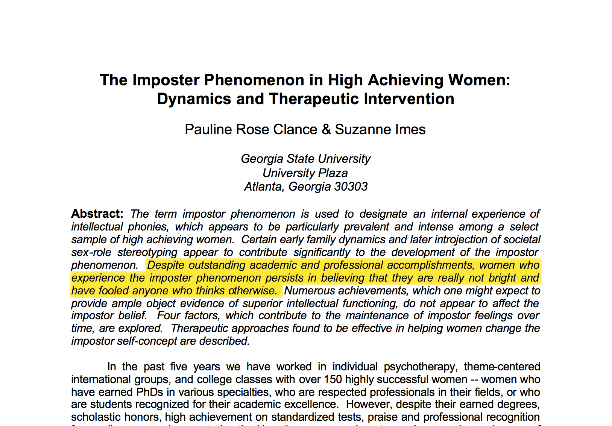

^ 
"Despite outstanding academic and professional accomplishments, women who experience the impostor phenomenon persist in believing that they are really not bright and have fooled anyone who thinks otherwise."

---

## [fit] Let me tell you a little bit about yourself

^
If that sounds like you, there's a few things I can guess about you.

---

### an introvert

---

### a perfectionist

---

### a workaholic

---

### a procrastinator

---

### afraid of failure

---

### uncomfortable when complimented

---

### feel less competent than your peers

^ Good news:

---

# [fit] you're not alone

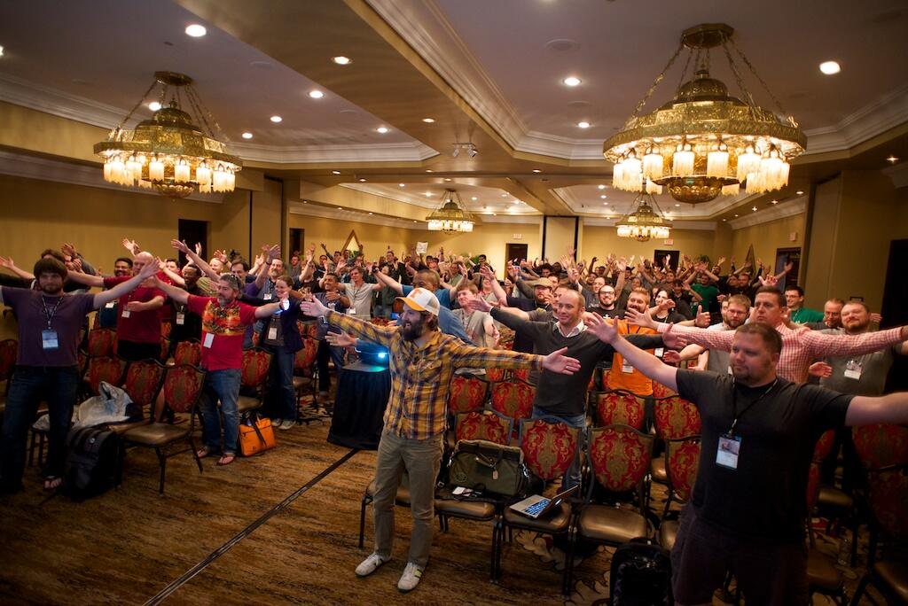

^
* impostor feelings are pretty normal

---

#[fit] 70%

^
* Dr. Clance's research
* There are varying degrees of struggle

---

# 2 things

^
2 things I want to do in this talk

---

## 1. How your brain trolls you

^
* How Impostor Syndrome tricks your brain
* Why it's hard to escape

---

## 2. How to patch your brain

^
* IS is like an infinte loop in the brain
* We need to add some hooks into that loop so we can stop it

---

# Let me tell you a story

^
* the first conference talk I ever gave

---

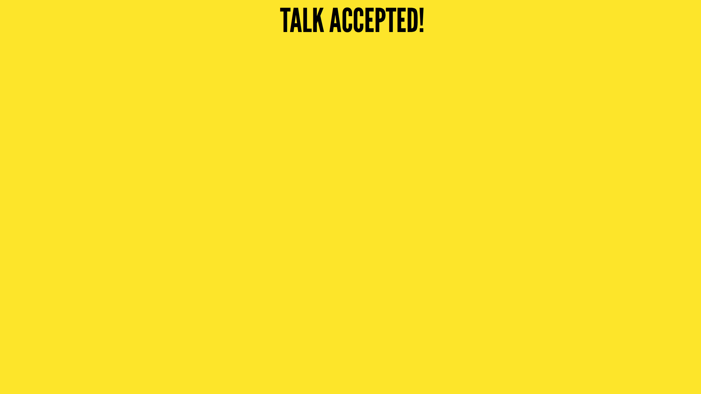

^
* Put my proposal in. Very much want success.
* Got excited when started getting feedback.
* Sitting at dinner table. Gasped. Wasn't expecting.

---

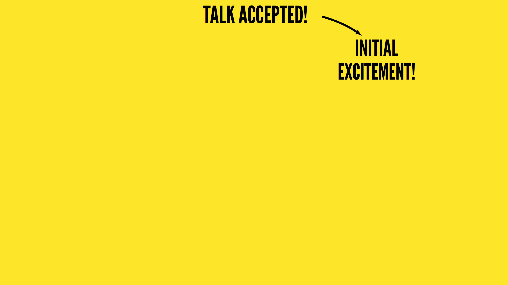

^
* Imagined my work colleagues congratulating me.
* Told a few close friends pre-embargo.

---

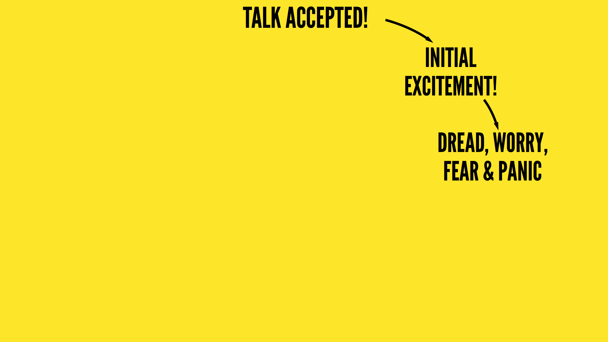

^
* Reality sets in. I have a talk to write.
* I can't write a talk. I can't hold an audience.
* I don't even have impostor syndrome bad enough to give a talk on impostor syndrome.
* Turns out that an impostor giving a talk on impostor syndrome is a very meta experience.

---

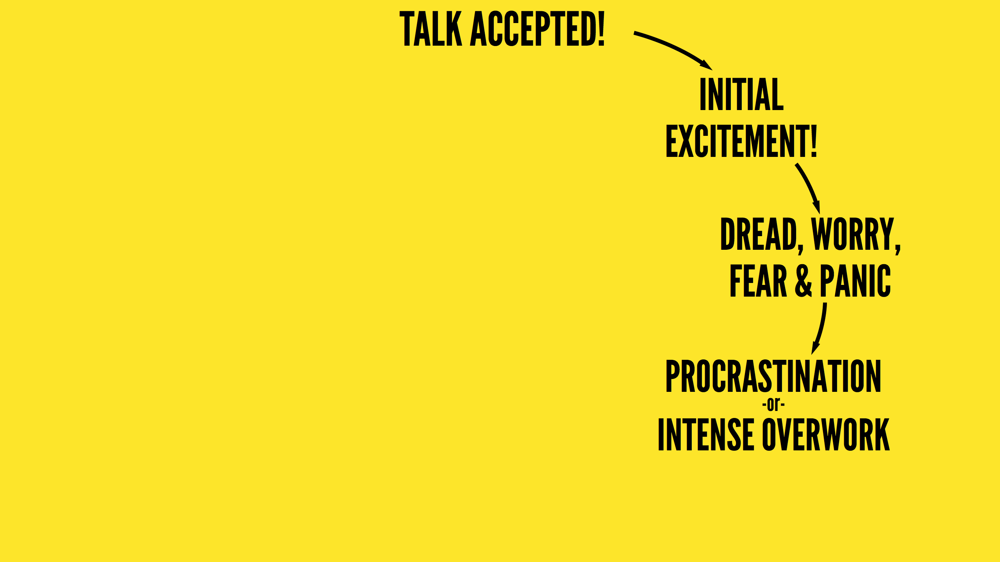

^
* Jumped into full-on overwork mode from day one.
* Loaded my Kindle with psych journal articles on IS for vacation.
* Read Dr. Clance's book cover to cover.
* 2a nights most of last week.
* Built this horrendous mind-map.

---

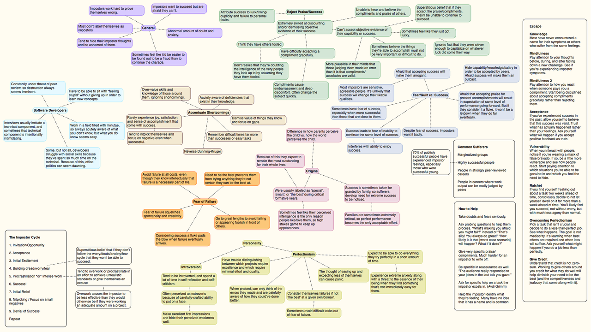

^
* Could've probably talked for 30 minutes about IS on the spot before all the prep.
* So much info it was hard to organize.

---

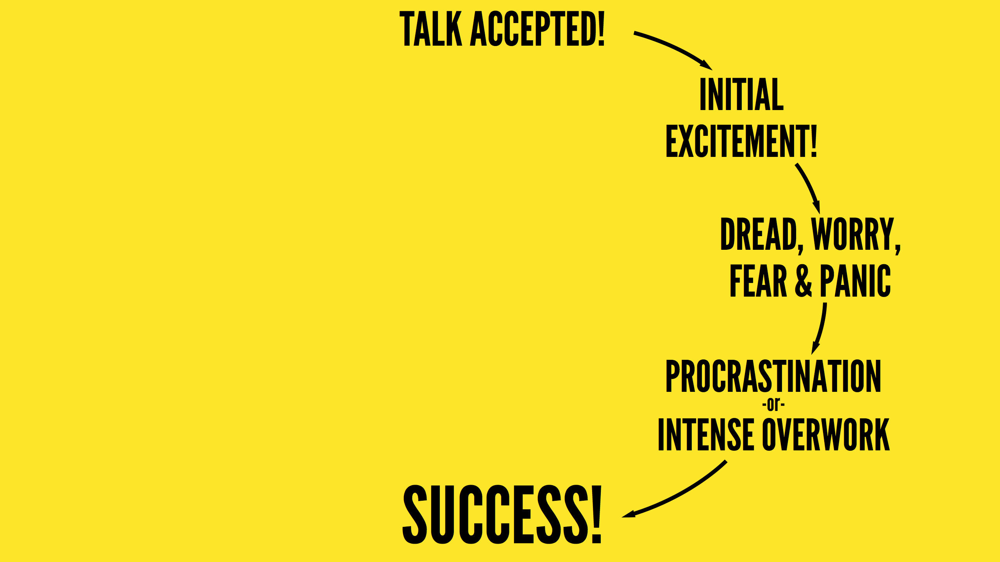

^
Jury's still out here. But I'm hopeful.

---

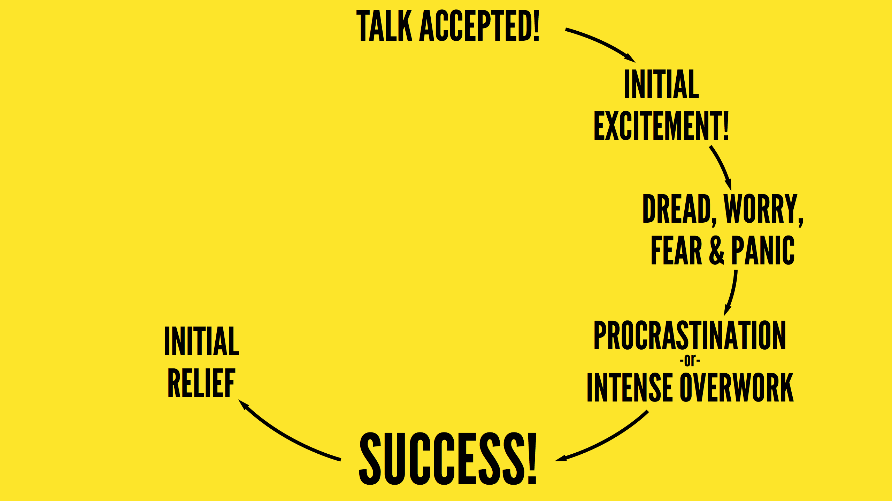

^
* Once I'm done, tremendous relief.
* Everyone claps.
* A few relevant QA questions.

---

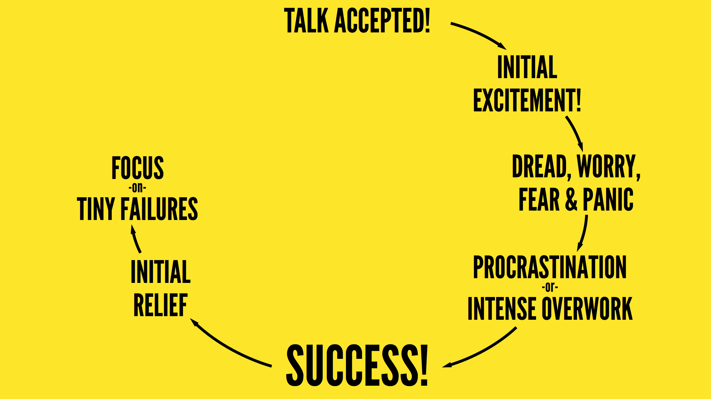

^
* But then the nitpicking starts.
* [Point out any mistakes so far in the talk]
* Whole new section I should've covered.

---

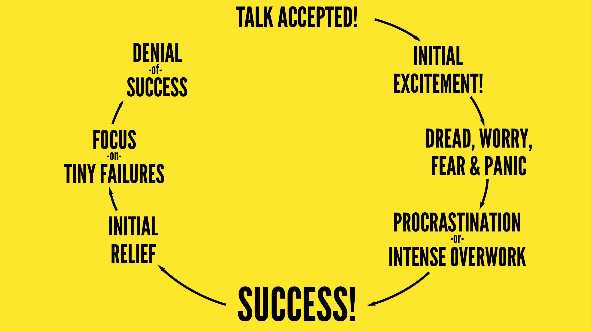

^
* Start to feel like stuff people are telling me isn't valid.
* Robs me of the ability to enjoying my success.
* Reaffirms that I only got in because I was lucky.

---

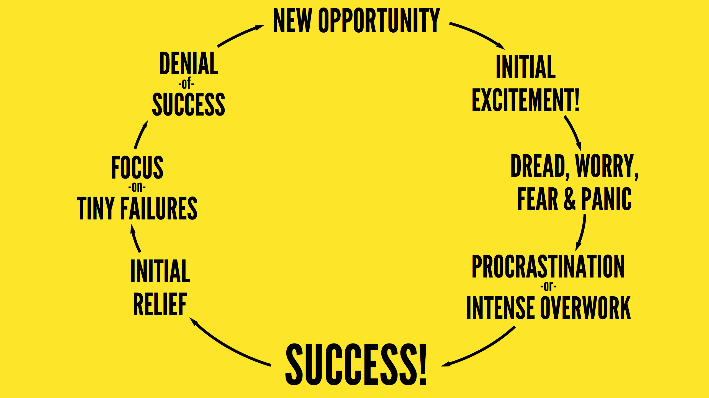

^
* Then, the next opportunity rolls around.
* The cycle repeats

---

## The Impostor Cycle

---

^
* Self-reinforcing
* Driven by a superstition that the fear/panic/dread/overwork cycle is requred for success
* Every time we do those things and we're successful, we believe a little more that they're required.

---

# About That Brain Of Yours

---

## Perfectionism

^
* Have very high standards for yourself; any less feels like failure
* Not enough to do well; must be the best
* Can lead to competition w/ coworkers

---

### Perfectionism → Workaholism

^
* Takes insane levels of effort to achieve your standards

---

### Perfectionism → Procrastination

^
* Forces you into turning in less-than-perfect work
* Allows you to forgive yourself in case you fail
"If I had really tried, I could've done it"

---

## Fear of Failure

^
* Terrified for others to see you struggle
* Work hard to never, ever appear foolish
* Avoid doing things you're not certain you can succeed at (ex: dancing)

---

## Denial of Success

^
* Compliment deflection
* Reject objective evidence
* Sometimes think success is a mistake (ex: talk accepted)
* Play down importance of success
* Attribute success to external factors and failure to internal factors

---

## Fear of Success

^
* Raises future expectations
* Might make you an outcast

---

# Impostor Sydrome and Technology

---

## Meritocracy

^
* Standards for success are subjective
* Sometimes affected by politics as much as ability
* Especially hard for under-represented groups

---

## Peer Scrutiny

^
* Actors, Musicians, Artists, Scientists, Professors
* Constant threat that someone may tell you you're crap
* Brain starts dutifully preparing you for that

---

## Constant Comparison

^
* Compare others' finished work to our messy thought process
* Software is messy, hard, terrible

---

## Vastness of Knowledge

^
* You know how much you don't know.
* Dunning/Kruger - Unskilled individuals think they're better than they are.

---

## Always Learning

^
* Have to sit with feeling stupid
* Push through

---

## Why It Matters To The Community

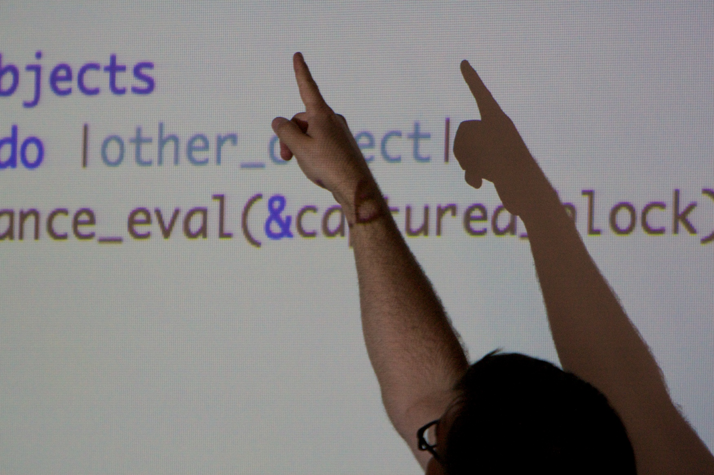

---

### Impostors don't:

---

# Impostors don't:

* Participate in conversations

^
* Hide in plain sight at user groups and conventions
* Feel like they don't belong, so if they hide they're safe

---

# Impostors don't:

* Participate in conversations
* Ask questions

^
* Hard for an impostor to admit they don't know something
* Pretend like they do, then try to understand later

---

# Impostors don't:

* Participate in conversations
* Ask questions
* Teach others

^
No user group talks, convention talks, helping at workshops

---

# Impostors don't:

* Participate in conversations
* Ask questions
* Teach others
* Contribute to Open Source

^
Nowhere the meritocracy shines through more than here
Afraid their contribution will be rejected, so they don't participate

---

# Impostors don't:

* Participate in conversations
* Ask questions
* Teach others
* Contribute to Open Source
* Find better jobs

^
Impostors feel lucky to have the job they have, so they don't try and find better ones

---

# Patching Your Brain

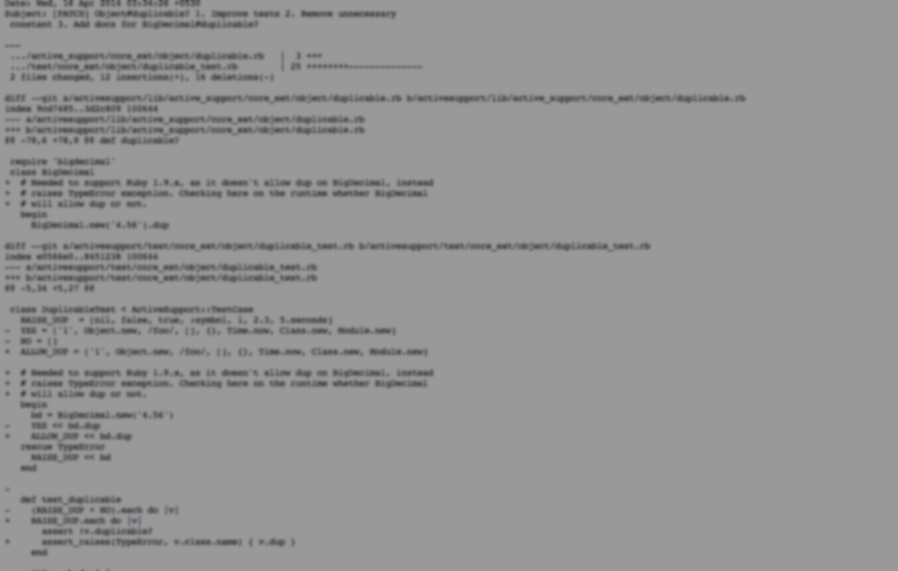

^
There's a lot you can do to short-circuit this cycle in your head

---

## Knowing is Half the Battle

^
You have a name for what you feel.
That's the start of the road to recovery.

---

## Pay Attention

^
Pay attention to how you react to compliments. Work to accept them gracefully. I'm still terrible at this.
Notice your patterns of behavior as you're preparing for something challenging. Confront your doubt.

---

## Accept Your Success

^
* Trust reality, not your feelings.
* - Are people around you morons?
* Accept compliments as true.
* Own your success.
* - Notice yourself writing off success, pause to give yourself credit.
* Requires smarts to use luck/timing.

---

## Forgive Your Mistakes

^
* Be kind to yourself.
* Notice self-criticism, pause to note what you did right.
* Compliment sandwich.

---

## Ratchet Your Freakout

^ 
* Hoo boy did I use this one.
* Don't allow yourself to freak out until your self-negotiated time.

---

## Embrace Vulnerability

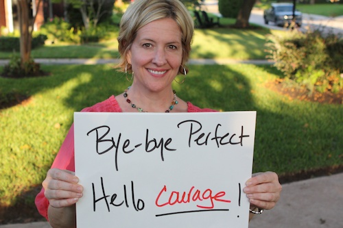

^
Allow yourself to admit you don't know things and ask questions
Brene Brown, The Power of Vulnerability

---

## \#pairwithme
### ( @nmeans)

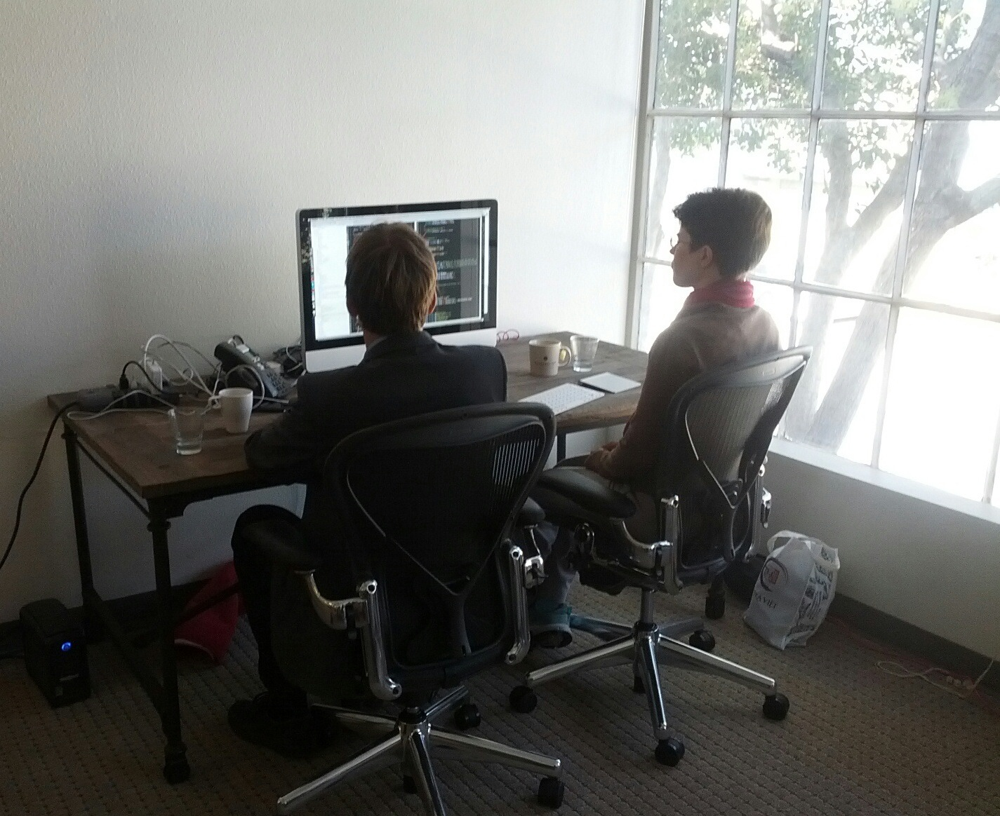

^
Give pair programming a shot
First time I'd ever been able to assess my skills honestly

---

## Keep Going

^
* Dunning-Kruger, The fact that you feel like an impostor probably means you have absolutely no reason to feel like an impostor.
* Never recovered, always recovering.

---

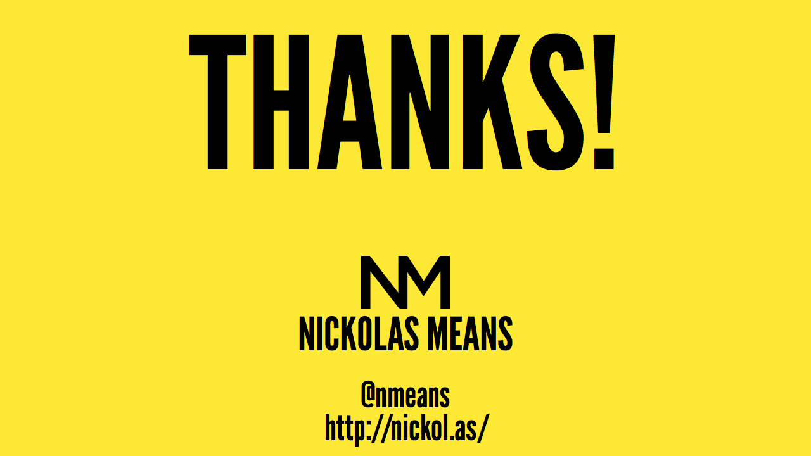

---

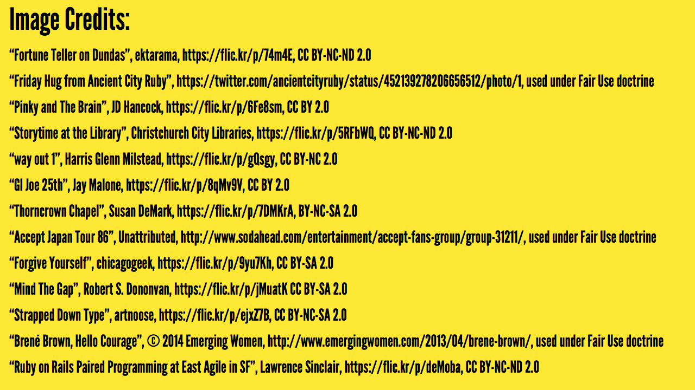

